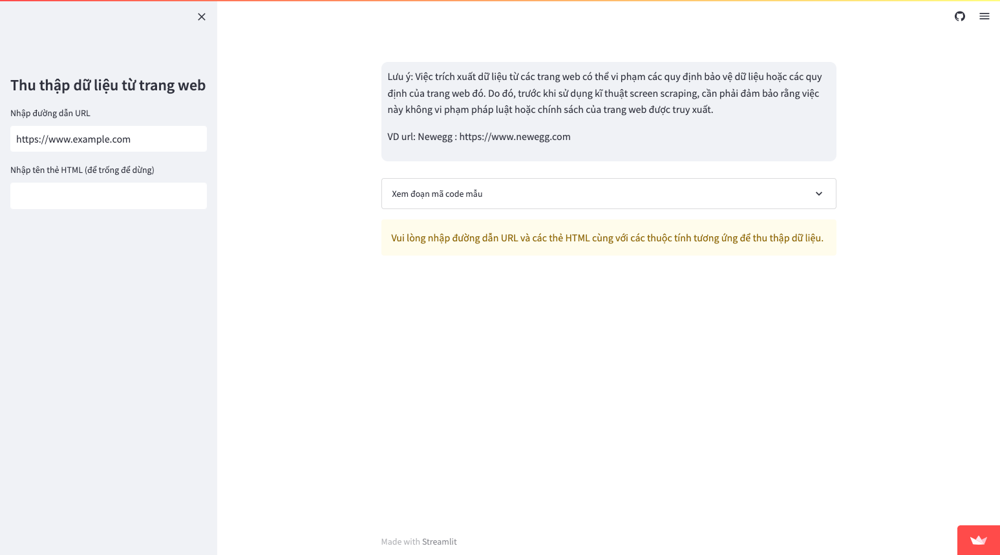

# Screen Scraping: Tổng quan về kỹ thuật và cách thực hiện

Screen scraping là một kỹ thuật được sử dụng để thu thập thông tin từ các trang web hoặc ứng dụng web khác mà không cần phải sử dụng các API hoặc giao diện lập trình ứng dụng (APIs). Kỹ thuật này giúp cho các nhà phát triển có thể thu thập thông tin từ các trang web hoặc ứng dụng web khác để phân tích dữ liệu hoặc tìm kiếm thông tin.

Bạn có thể xem một vài đoạn code mẫu về kỹ thuật Screen Scraping trong [web_scraping](web_scraping/)

## Các công cụ Screen Scraping phổ biến

Có nhiều công cụ Screen Scraping phổ biến có sẵn để giúp cho việc thu thập dữ liệu từ các trang web hoặc ứng dụng web trở nên dễ dàng hơn. Dưới đây là một số công cụ phổ biến:

1. Beautiful Soup: Là một thư viện Python phổ biến được sử dụng để phân tích HTML và XML. Nó cung cấp cho người dùng các phương thức để lấy dữ liệu từ các trang web một cách nhanh chóng và dễ dàng.

2. Scrapy: Là một framework Python phổ biến cho phép người dùng thu thập dữ liệu từ các trang web một cách tự động. Scrapy có thể sử dụng để lấy dữ liệu từ một hoặc nhiều trang web và tổ chức chúng vào một cách hiệu quả.

3. Selenium: Là một công cụ phổ biến cho phép người dùng tự động hóa các hành động trên trình duyệt web. Nó cung cấp cho người dùng các phương thức để tương tác với các trang web một cách tự động và thu thập dữ liệu từ đó.

## Những lưu ý khi sử dụng Screen Scraping

Khi sử dụng kỹ thuật Screen Scraping, bạn cần lưu ý những điều sau:

1. Luôn luôn tuân thủ các quy định và điều khoản sử dụng của các trang web. Việc lấy dữ liệu từ các trang web mà không được phép có thể dẫn đến hậu quả pháp lý.

2. Cẩn thận khi sử dụng các công cụ Screen Scraping. Việc sử dụng các công cụ không đúng cách có thể gây ra tình trạng spam hoặc tình trạng server overload cho các trang web, gây ảnh hưởng đến trải nghiệm của người dùng.

3. Luôn cập nhật và kiểm tra lại các mã code của mình. Việc sử dụng các công cụ Screen Scraping có thể bị phát hiện và chặn bởi các trang web, do đó, cần thường xuyên cập nhật và kiểm tra lại mã code để đảm bảo sự ổn định và hiệu quả.

## [Một chương trình về Screen Scraping](https://hoangvantuan123-app-web-scraping-streamlit-app-76giua.streamlit.app/) 
 

